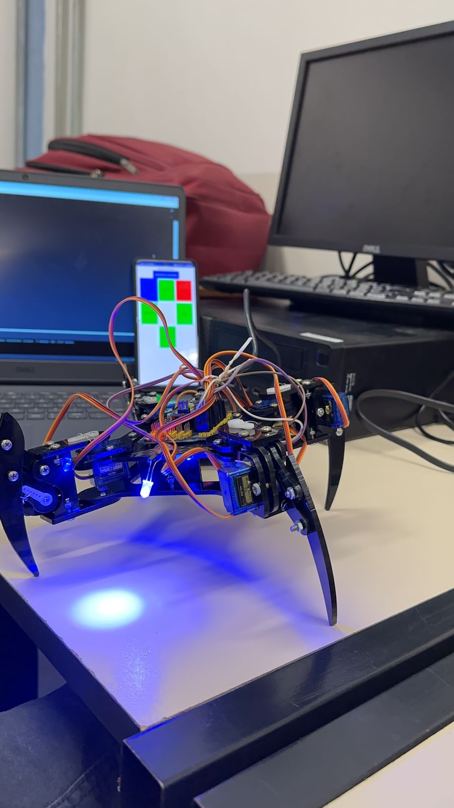
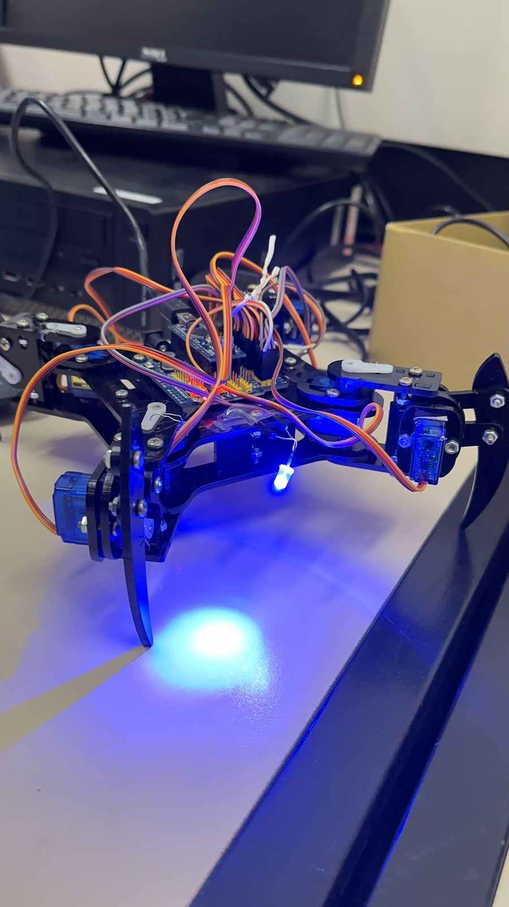
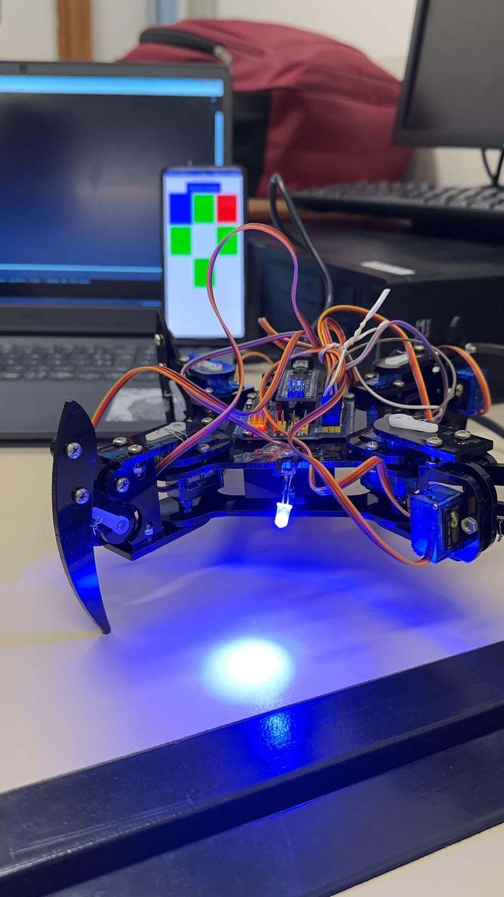
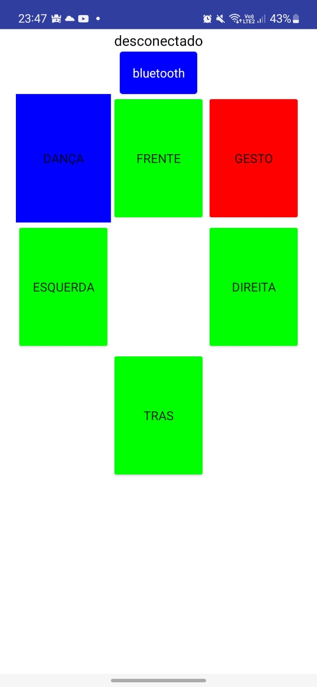

# ROBÔ ARANHA (Spindle)

**PUC MINAS | Campus Coração Eucarístico**  
**Curso:** Engenharia de Computação – 1º Semestre  
**Disciplinas:** Laboratório de Introdução à Engenharia de Computação, AEDs I e Introdução à Computação

---

##  Resumo
**Apresentamos Spindle!** Uma aranha-robô simpática e ágil, com quatro patas que se movem com precisão e graça.

O projeto consiste na criação de um robô-aranha quadrúpede equipado com:
* **Hardware:** Arduino Nano e Módulo Bluetooth HC-05.
* **Atuadores:** 8 servomotores para movimentos independentes.
* **Linguagem:** C++ (Arduino IDE).

A estrutura permite grande mobilidade e estabilidade em superfícies variadas, com controle via smartphone.

---

##  Integrantes
* Samuel Roman Pujatti e Andrade
* Lucas Batista
* Sophia da Costa Fernandes
* Ravi Dornellas e Silva

**Orientadores:** Felipe Lara, Sandro Jerônimo de Almeida e Naísses Zóia Lima.

---

## 📂 Estrutura do Projeto

*  [Código Fonte (Arduino)](./Codigo/README.md)
*  [Aplicativo para Smartphone](./App/README.md)
*  [Manual de Utilização](./Manual/manual%20de%20utilização.md)

### 📄 Documentação 
1. [Introdução](./Documentacao/01-Introducão.md)
2. [Metodologias Ágeis](./Documentacao/02-Metodologias%20Ágeis.md)
3. [Desenvolvimento](./Documentacao/03-Desenvolvimento.md)
4. [Testes](./Documentacao/04-Testes.md)
5. [Conclusão](./Documentacao/05-Conclusão.md)
6. [Referências](./Documentacao/06-Referências.md)

---

##  Galeria
Algumas iamgens do projeto:

---